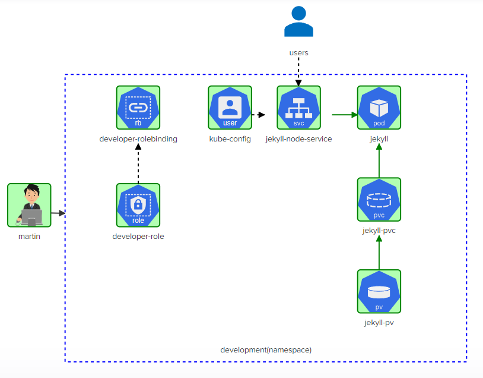
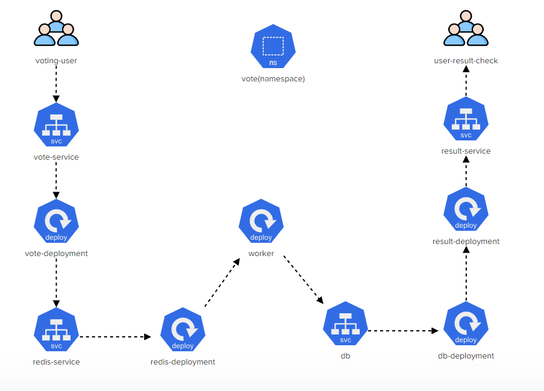
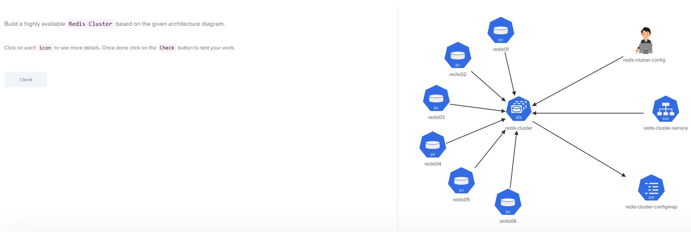
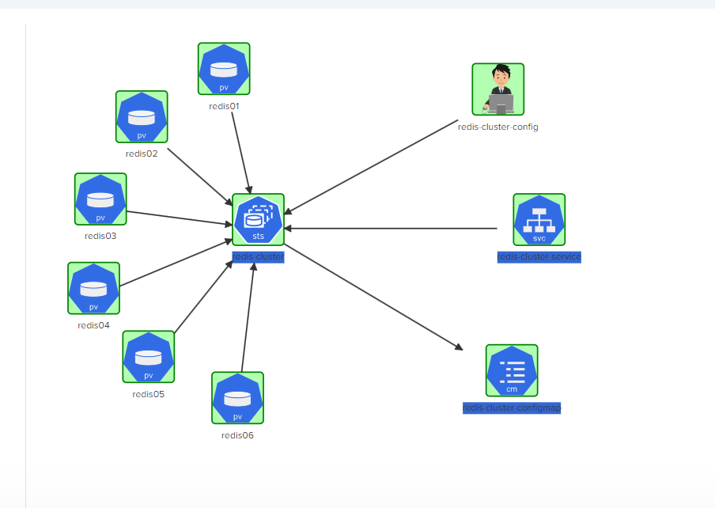

# Kubernetes Challenges

## Challenge 1



https://kodekloud.com/topic/lab-kubernetes-challenge-1/

### User

    kubectl config set-credentials martin --client-key=/root/martin.key --client-certificate=/root/martin.crt --embed-certs=false
    kubectl config set-context developer --cluster=kubernetes --user=martin

### Role

    kubectl create role developer-role -n development --verb="*" --resource="services,pods,persistentvolumeclaims"

### Rolebinding

    kubectl create rolebinding developer-rolebinding --role="developer-role" --namespace=development --user=martin

### Context
    kubectl config set-context developer --user=martin --namespace=development --cluster=kubernetes
    kubectl config use-context developer

### Persistent Volume Claim

Describe the Persistent Volume

    kubectl config use-context kubernetes-admin@kubernetes
    kubectl describe persistentvolume jekyll-site
    kubectl config use-context developer

Note the line `StorageClass:      local-storage`

Create a file named `jekyll-site-pvc.yml` with the following content, making `storageClassName` :

```yaml
---
apiVersion: v1
kind: PersistentVolumeClaim
metadata:
  name: jekyll-site
  namespace: development
spec:
  storageClassName: local-storage
  accessModes:
    - ReadWriteMany
  resources:
    requests:
      storage: 1Gi
```

### Jekyll Pod

Create a file named `jekyll-pod.yml` with the following contents:

```yaml
apiVersion: v1
kind: Pod
metadata:
  name: jekyll
  labels:
    run: jekyll
spec:
  volumes:
  - name: site
    persistentVolumeClaim:
      claimName: jekyll-site
  initContainers:
  - name: copy-jekyll-site
    image: 'kodekloud/jekyll'
    command: ["jekyll", "new", "/site"]
    volumeMounts:
    - name: site
      mountPath: /site
  containers:
  - name: jekyll
    image: 'kodekloud/jekyll-serve'
    volumeMounts:
    - name: site
      mountPath: /site
```

### Jekyll Service

Create a file named `jekyll-service.yml` with the following contents:

```yaml
---
apiVersion: v1
kind: Service
metadata:
  name: jekyll
spec:
  selector:
    run: jekyll
  type: NodePort
  ports:
    - protocol: TCP
      port: 8080
      targetPort: 4000
      nodePort: 30097
```

## Challenge 2

### Fix Control Plane


To fix the controlplane node:

1. Check `~/.kube/config` file
    - Fix Port from 6433 to 6443
2. Check `/etc/kubernetes/manifests/kube-apiserver`
    - Fix certificate name
    - Restart kubelet
3. Fix CoreDNS
    - `kubectl edit deployment/coredns -n kube-system`
    - Fix image name and version

### Fix Node01
To fix node01, just uncordon it

`kubectl uncordon node01`

### Deploy File Server

#### Copy images to /web on node01

A simple SCP will do

`scp /media/* node01:/web/`

#### data-pv
```yaml

apiVersion: v1
kind: PersistentVolume
metadata:
  name: data-pv
  labels:
    type: local
spec:
  storageClassName: manual
  capacity:
    storage: 1Gi
  accessModes:
    - ReadWriteMany
  hostPath:
    path: "/web"
```

#### data-pvc
```yaml
apiVersion: v1
kind: PersistentVolumeClaim
metadata:
  name: data-pvc
spec:
  storageClassName: manual
  accessModes:
    - ReadWriteMany
  resources:
    requests:
      storage: 1Gi
  volumeName: data-pv
```

#### gop-file-server-pod
```yaml
apiVersion: v1
kind: Pod
metadata:
  name: gop-file-server
spec:
  containers:
    - name: gop-file-server
      image: kodekloud/fileserver
      volumeMounts:
        - name: data-store
          mountPath: /web
  volumes:
    - name: data-store
      persistentVolumeClaim:
        claimName: data-pvc
```

#### gop-file-server-service
```yaml
apiVersion: v1
kind: Pod
metadata:
  name: gop-file-server
spec:
  containers:
    - name: gop-file-server
      image: kodekloud/fileserver
      volumeMounts:
        - name: data-store
          mountPath: /web
  volumes:
    - name: data-store
      persistentVolumeClaim:
        claimName: data-pvc
```

## Challenge 3



### Create namespace vote
    kubectl create namespace vote

### Create vote-deployment

    apiVersion: apps/v1
    kind: Deployment
    metadata:
      name: vote-deployment
    spec:
      replicas: 1
      selector:
        matchLabels:
          app: votingapp
      template:
        metadata:
          labels:
            app: votingapp
        spec:
          containers:
          - name: vote-deployment
            image: kodekloud/examplevotingapp_vote:before
            ports:
            - containerPort: 80

Apply the deployment to the vote namespace

    kubectl apply -f vote-deployment.yml -n vote

### Create vote-service

    apiVersion: v1
    kind: Service
    metadata:
      name: vote-service
    spec:
      selector:
        app: votingapp
      type: NodePort
      ports:
        - protocol: TCP
          port: 5000
          targetPort: 80  
          nodePort: 31000


### Create result-deployment and result-service

```yaml
apiVersion: v1
kind: Service
metadata:
  name: result-service
spec:
  selector:
    app: resultapp
  type: NodePort
  ports:
    - protocol: TCP
      port: 5001
      targetPort: 80
      nodePort: 31001
````


``` YAML
apiVersion: apps/v1
kind: Deployment
metadata:
  name: result-deployment
spec:
  replicas: 1
  selector:
    matchLabels:
      app: resultapp
  template:
    metadata:
      labels:
        app: resultapp
    spec:
      containers:
      - name: result-deployment
        image: kodekloud/examplevotingapp_result:before
        ports:
         - containerPort: 80
```

### Redis-deployment

```yaml
apiVersion: apps/v1
kind: Deployment
metadata:
  name: redis-deployment
spec:
  replicas: 1
  selector:
    matchLabels:
      app: redisapp
  template:
    metadata:
      labels:
        app: redisapp
    spec:
      containers:
      - name: redis-deployment
        image: redis:alpine
        ports:
         - containerPort: 6379
        volumeMounts:
         - name: redis-data
           mountPath: /data
      volumes:
      - name: redis-data
        emptyDir: {}
```
## Redis-service

```yaml
apiVersion: v1
kind: Service
metadata:
  name: redis
spec:
  selector:
    app: redisapp
  type: ClusterIP
  ports:
    - protocol: TCP
      port: 6379
      targetPort: 6379

```

## DB deployment

```yaml
apiVersion: apps/v1
kind: Deployment
metadata:
  name: db-deployment
spec:
  replicas: 1
  selector:
    matchLabels:
      app: dbapp
  template:
    metadata:
      labels:
        app: dbapp
    spec:
      containers:
      - name: db-deployment
        image: postgres:9.4
        env:
        - name: POSTGRES_HOST_AUTH_METHOD
          value: trust
        ports:
         - containerPort: 5432
        volumeMounts:
         - name: db-data
           mountPath: /var/lib/postgresql/data
      volumes:
      - name: db-data
        emptyDir: {}
```

### DB Service

```yaml
apiVersion: v1
kind: Service
metadata:
  name: db
spec:
  selector:
    app: dbapp
  type: ClusterIP
  ports:
    - protocol: TCP
      port: 5432
      targetPort: 5432
```

### Worker deployment

```yaml
apiVersion: apps/v1
kind: Deployment
metadata:
  name: worker
spec:
  replicas: 1
  selector:
    matchLabels:
      app: worker
  template:
    metadata:
      labels:
        app: worker
    spec:
      containers:
      - name: worker
        image: kodekloud/examplevotingapp_worker
```

## Challenge 4



### Create needed folders on the worker node:

```shell
mkdir redis01 redis02 redis03 redis04 redis05 redis06
```
### Create all the persistent volumes

#### data-pv
```yaml
---
apiVersion: v1
kind: PersistentVolume
metadata:
  name: redis01
  labels:
    type: local
spec:
  capacity:
    storage: 1Gi
  accessModes:
    - ReadWriteOnce
  hostPath:
    path: "/redis01"
    ---
  apiVersion: v1
kind: PersistentVolume
metadata:
  name: redis02
  labels:
    type: local
spec:
  capacity:
    storage: 1Gi
  accessModes:
    - ReadWriteOnce
  hostPath:
    path: "/redis02"
---
  apiVersion: v1
kind: PersistentVolume
metadata:
  name: redis03
  labels:
    type: local
spec:
  capacity:
    storage: 1Gi
  accessModes:
    - ReadWriteOnce
  hostPath:
    path: "/redis03"
---
  apiVersion: v1
kind: PersistentVolume
metadata:
  name: redis04
  labels:
    type: local
spec:
  capacity:
    storage: 1Gi
  accessModes:
    - ReadWriteOnce
  hostPath:
    path: "/redis04"
  ---
  apiVersion: v1
kind: PersistentVolume
metadata:
  name: redis05
  labels:
    type: local
spec:
  capacity:
    storage: 1Gi
  accessModes:
    - ReadWriteOnce
  hostPath:
    path: "/redis05"
 ---
  apiVersion: v1
kind: PersistentVolume
metadata:
  name: redis06
  labels:
    type: local
spec:
  capacity:
    storage: 1Gi
  accessModes:
    - ReadWriteOnce
  hostPath:
    path: "/redis06"
  ```

### Create the StateFulSet Redis-Cluster

```yaml
apiVersion: apps/v1
kind: StatefulSet
metadata:
  name: redis-cluster
spec:
  selector:
    matchLabels:
      app: redis-cluster
  serviceName: "redis-cluster-service"
  replicas: 6 
  template:
    metadata:
      labels:
        app: redis-cluster
    spec:
      volumes:
        - name: conf
          configMap:
            name: redis-cluster-configmap
            defaultMode: 0755

      containers:
      - name: redis
        image: redis:5.0.1-alpine
        command:  ["/conf/update-node.sh", "redis-server", "/conf/redis.conf"]
        env:
        - name: POD_IP
          valueFrom: 
            fieldRef:
              fieldPath: status.podIP
              apiVersion: v1
        ports:
        - containerPort: 6379
          name: client
        - containerPort: 16379
          name: gossip
        volumeMounts:
        - name: conf
          mountPath: /conf
          readOnly: false
        - name: data
          mountPath: /data
          readOnly: false
             
  volumeClaimTemplates:
  - metadata:
      name: data
    spec:
      accessModes: [ "ReadWriteOnce" ]
      resources:
        requests:
          storage: 1Gi
```

### Create redis-cluster-service:

```yaml
apiVersion: v1
kind: Service
metadata:
  name: redis-cluster-service
spec:
  ports:
    - protocol: TCP
      name: client
      port: 6379
      targetPort: 16379
    - protocol: TCP
      name: gossip
      port: 16379
      targetPort: 16379
     

```

### Run the redis-cluster-config command:

```shell
 kubectl exec -it redis-cluster-0 -- redis-cli --cluster create --cluster-replicas 1 $(kubectl get pods -l app=reddis-cluster -o jsonpath='{range.items[*]}{.status.podIP}:6379 {end}')
```

